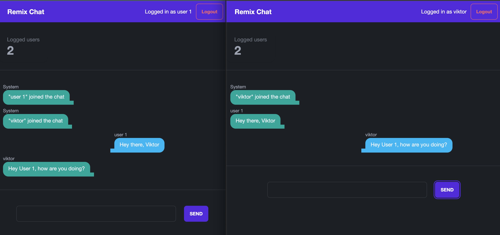

# Remix chat app
This is a small isomorphic applications that allows different 
clients to exchange messages. Built on top of React, Node, Remix, Typescripts and Tailwind. 

Generally, user opens and app and choose name to join, then will be redirected to chat window. Auth is oversimplified 
for the sake of trying Remix.

Screenshot of usage below:

## General architecture
As everything with Remix, there is a small Node server that servers public files and Remix. There is a Remix server that acts as middleware
And of course, Remix client code with routes and components. Those are written with React. Everything except node server file is Typescript.

Everything is pretty basic, one interesting approach is how live chat works. Usually, this is implemented via sockets, so updates are instant.
But, due to unique Remix approach to client/server architecture, it's possible to use simple pub/sub as an EvenSource between different clients.
To see more info, look into `app/routes/live.chat.ts`.

## How to install
Simple as running `npm i` should be enough to install all.

## How to start
This project can be started in 2 modes:

* For running in dev mode just execute `npm run dev` and wait until all is built
* For running in prod mode, first build the project by running `npm run build` then run using `npm run start`

## Contribution
Feel free to fork this repo or create a PR. As I mentioned, lots of stuff is missing. 
To name a few: normal auth and chat rooms. But, the goal for this project was to play around Remix.